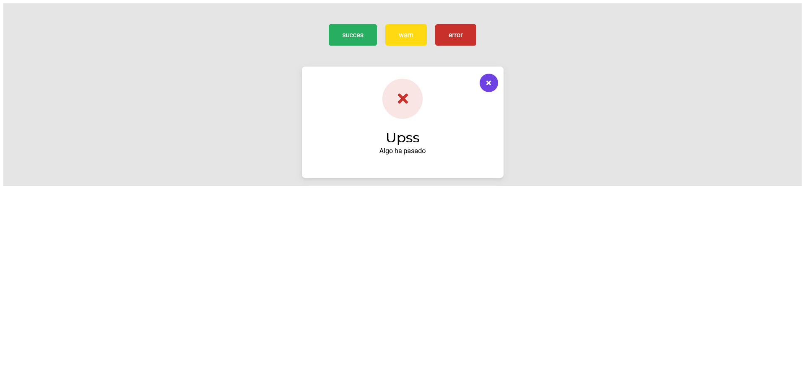
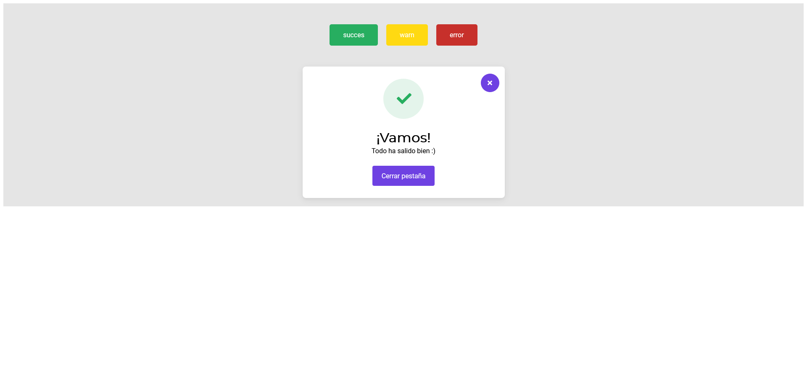
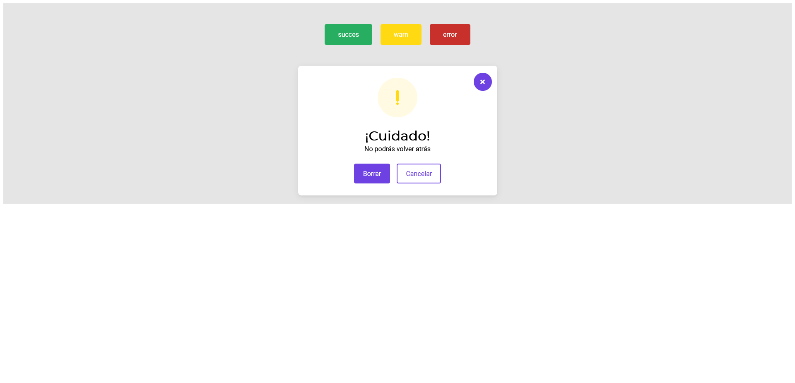

# Nuew.io Dialog design system

Esta es una solución al reto propuesto en Nuwe.io sobre un diseño de sistema de dialogo

## Tabla de contenidos

- [Overview](#overview)
  - [The challenge](#the-challenge)
  - [Screenshot](#screenshot)
  - [Links](#links)
- [My process](#my-process)
  - [Built with](#built-with) 
- [Author](#author)

## Overview

### El reto

* Tarea 1 → Que se pueda ver el diseño de los diálogos de warning

* Tarea 2 → Que se pueda ver el diseño para los diálogos de success

* Tarea 3 → Que se pueda ver el diseño para los diálogos de error

* Tarea 4 → Que se pueda ver 3 botones para abrir cada uno de los diálogos y las acciones de cerrar y aceptar son funcionales

### Screenshot

### Links

- Solution URL: [Add solution URL here](https://github.com/ManuelFernandezEsteban/dialog-system.git)
- Live Site URL: [Add live site URL here](https://manuelfernandezesteban.github.io/dialog-system/)

### Built with

- HTML5
- CSS3
- JavaScript

## Author

Manuel Fernández Esteban

